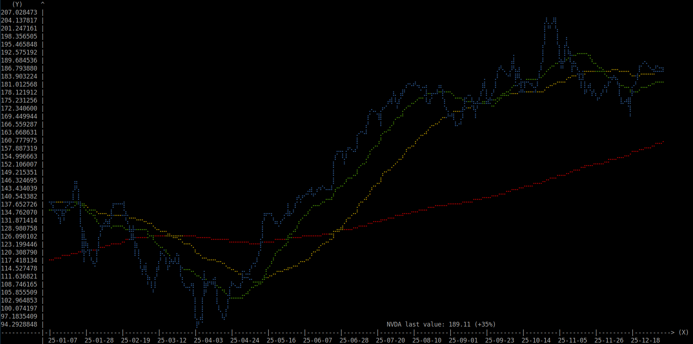
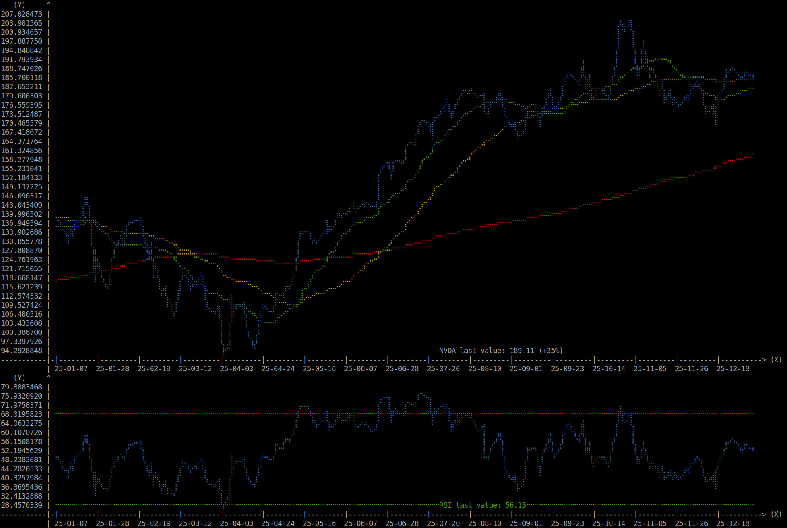
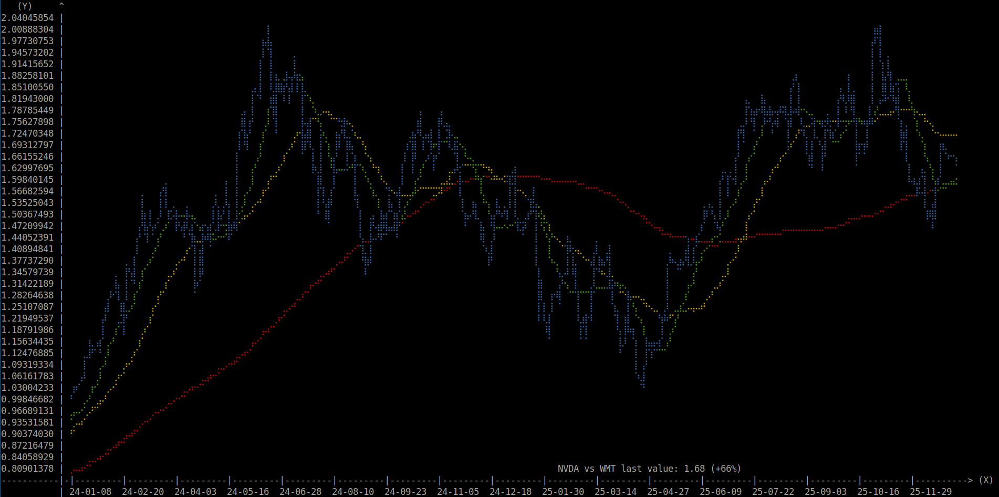

# Tsigna

A terminal-based financial charting tool for plotting stock prices, moving averages, and technical indicators. It is most useful for medium-term trading.

## Description

Tsigna is a Python financial analysis tool that runs entirely in the terminal. It fetches historical stock data from Yahoo Finance, calculates technical indicators including moving averages, MACD, and RSI, and displays them as text-based charts using the plotille library. The tool supports single ticker analysis, ratio comparisons between two tickers, and a special MMRI calculation. Users can customize the time period and split the terminal display to show multiple indicators simultaneously.



## Background

Originally I was looking for a free online tool to plot the **ratio between two tickers**. I didn't find such a tool so I made it. I'm a Linux guy, so of course it had to run in the terminal.

The name Tsigna comes from 'T' for terminal and 'signa', which is the plural form of signum, the latin word for signal. The 'T' also stands for technical, like in technical indicators, from which we get technical signals.



## Installation

Tsigna has been developped with Python 3.11 but may work with older versions. You can check your version with the `python3 --version` or `python --version` command. Only a few external libraries are required.

### Install Dependencies

Tsigna depends on the [pandas](https://github.com/pandas-dev/pandas), [plotille](https://github.com/tammoippen/plotille) and [yahooquery](https://github.com/dpguthrie/yahooquery) libraries and their dependencies. It is recommended to install them within a [virtual environment](https://docs.python.org/3/tutorial/venv.html).

Note that the following instructions have only been tested on Linux. On Windows you may need to use the `python` and `pip` commands instead of `python3` and `pip3`.

1.  **Create a virtual environment** in a directory of your choice:
    
    ```bash
    python3 -m venv tsigna-env
    ```
    
2.  **Activate the virtual environment**:

	On Linux and macOS:
    ```bash
    source tsigna-env/bin/activate
    ```
    On Windows:
    ```bash
    tsigna-env\Scripts\activate
    ```

3.  **Install the required libraries**:
    
    ```bash
    pip3 install pandas plotille yahooquery
    ```

After installing the dependencies, you are ready to download and run Tsigna.

## Usage

### Basic Usage

On Linux you should be able to run Tsigna directly if its location is in your path:

```bash
tsigna.py [arguments] ticker1 [ticker2]
```

Otherwise you can run it with Python:

```bash
python3 tsigna.py [arguments] ticker1 [ticker2]
```

### Command-Line Arguments

| Argument      | Short Flag | Description                          | Default         |
| ------------- | ---------- | ------------------------------------ | --------------- |
| `--help`      | `-h`       | Show help message                    |           |
| `--macd`      | `-m`       | Display MACD indicator plot          | `False`         |
| `--macd-only` | `-M`       | Display **only** MACD indicator plot | `False`         |
| `--no-cache`  | `-n`       | Bypass cache and get latest data     | `False`         |
| `--periods`   | `-p`       | Set moving averages periods          | `[20, 50, 100]` |
| `--rsi`       | `-r`       | Display RSI indicator plot           | `False`         |
| `--rsi-only`  | `-R`       | Display **only** RSI indicator plot  | `False`         |
| `--years`     | `-y`       | Set years to plot, use 0 for ytd     | `1`             |

## Configuration

You can edit the configuration constants directly at the top of the tsigna.py file if you wish to change the default behavior. For example you can change the expiration time of the cache (it is 5 minutes by default) or disable it. You can also change the colors of the lines, the parameters of the technical indicators, etc.

## Not Financial Advice

I do not own any of the stocks in the examples, I chose them because they are very popular.

## Acknowledgements

Tsigna is not doing much more than getting data from [yahooquery](https://github.com/dpguthrie/yahooquery), processing it with [pandas](https://github.com/pandas-dev/pandas), and plotting it with [plotille](https://github.com/tammoippen/plotille), so thanks to the creators and contributors of these great libraries for making it possible.

Thanks also to the [ticker](https://github.com/achannarasappa/ticker) project, which is pretty much the only other financial tool I use along with [tsigna](https://github.com/monsieurlinux/tsigna) to make my investing decisions.
